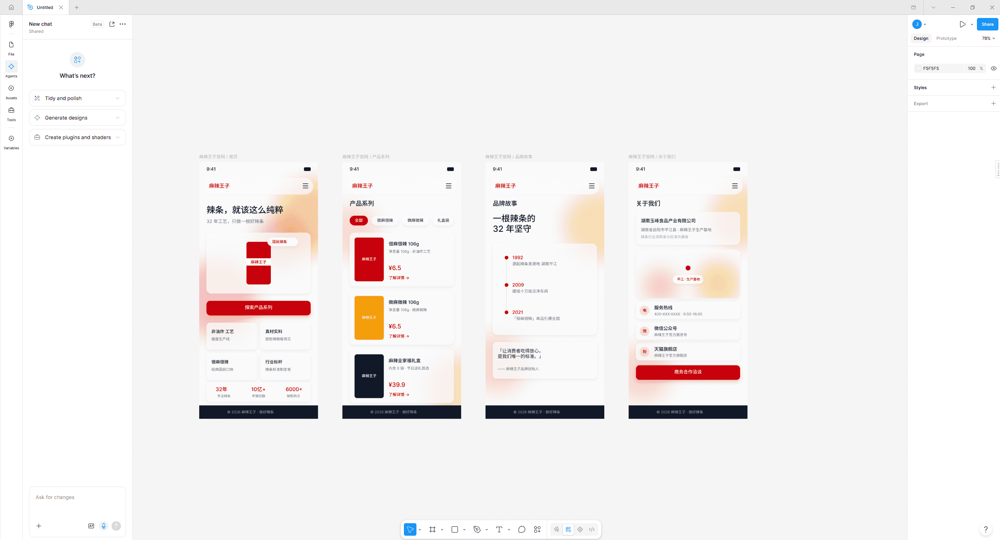
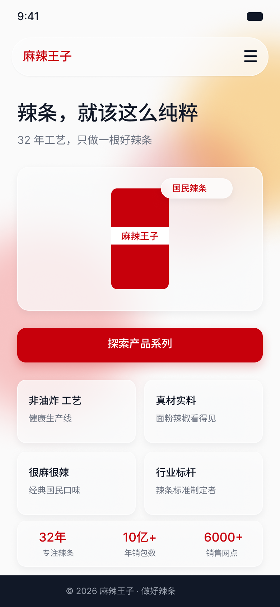
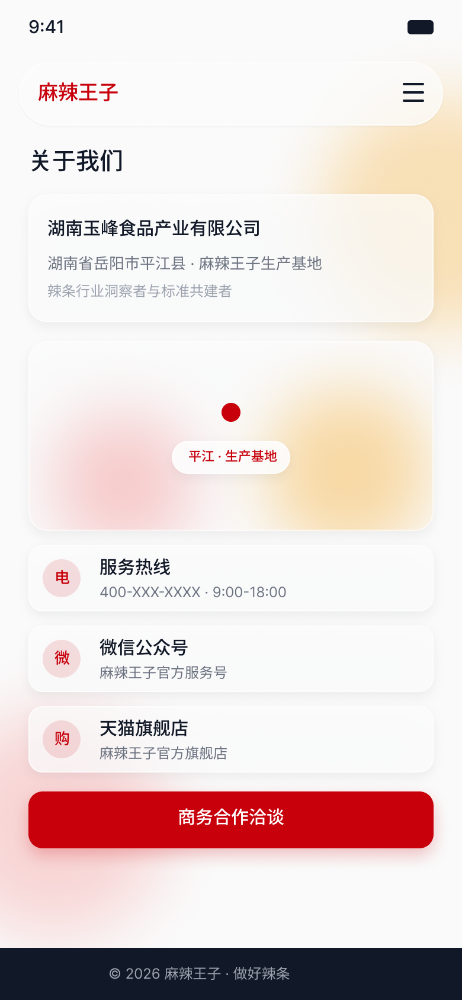
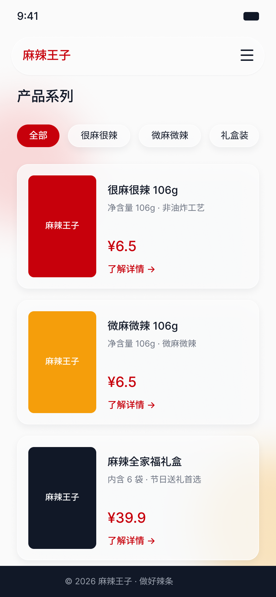
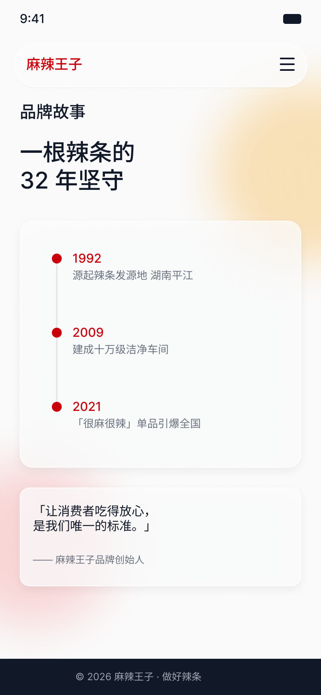

# agent-design-figma · AI UI Design Skill

[中文版](README.md)

In a nutshell: **Just say "Design a homepage for an AI healthcare App", and it automates the entire process from design brief, to Figma rendering, to quality review and asset export.**

After installation, you only need to tell the AI what you want to design — industry style, color palette, typography, components, and page structure are all automatically inferred by the Skill. The generated results will go through an automated visual critique, and any non-compliant parts will be automatically fixed and re-checked.

## Project Background & Origins

This project is derived from my full-stack open-source experimental project — [JasonOracle/figma-agent-bridge](https://github.com/JasonOracle/figma-agent-bridge) (which aims to explore the full-pipeline automation of AI Agents from design system construction, full-page high-fidelity design, to front-end code generation).

In the original `figma-agent-bridge` project, I successfully built a local bridge that allows AI to directly manipulate a real Figma canvas. To make this powerful "AI Design Brain" more widely reusable, I extracted its core **Automated UI Design Skill**, deeply optimized and encapsulated it, and spun it off into this standalone `agent-design-figma` project.

It focuses on solving a core scenario: **empowering Large Language Models (LLMs) with professional UI design cognition and cross-platform execution capabilities**. You can use it as an independent component, seamlessly integrate it into your own AI assistant or Agent development workflow, and obtain an out-of-the-box automated design pipeline with zero barriers to entry.

## What It Can Do

| You Input | You Get |
|---|---|
| "Design a modern AI health management App homepage" | Design Brief → Design System → **Figma Page (Auto-drawn)** → Visual Quality Critique Report → PNG / SVG / Export Manifest |
| "Design a Henan highway smart maintenance dashboard" | Same as above, automatically applying a dark-themed government dashboard style and industry color palette |
| "Design an enterprise backend Dashboard" | Same as above, automatically applying an enterprise-level backend style |

Supports Chinese industry semantics (healthcare / government / education / enterprise backend, etc.). Color palettes and styles are derived from built-in industry mapping rules, not random, and not templated.

## Actual Generation Showcase

Below is a showcase of real output generated and rendered to Figma by the LLM entirely automatically, after a new user installed the Skill and gave a simple one-sentence instruction.

**Figma Client Real Canvas Rendering Effect:**

<div align="center">
  
</div>
<br/>

**Generated High-Fidelity Page Details (including Home, Products, About Us, etc.):**

<div align="center">
  
  
</div>
<br/>
<div align="center">
  
  
</div>

*Note: The above pages, from product structure planning, copywriting, design system construction, to Figma node rendering, are completed entirely by the Agent automatically with zero manual intervention.*

## Installation (3 Steps)

**1. Clone this repository into your skills directory** (pick the one your tool actually reads; if unsure, put it in both)

```bash
# WorkBuddy —— Windows corresponds to %USERPROFILE%\.workbuddy\skills\
git clone https://github.com/JasonOracle/agent-design-figma.git ~/.workbuddy/skills/agent-design-figma

# CodeBuddy / Some IDE tools read this one —— Windows corresponds to %USERPROFILE%\.codebuddy\skills\
git clone https://github.com/JasonOracle/agent-design-figma.git ~/.codebuddy/skills/agent-design-figma
```

If you are unfamiliar with git, you can also download the ZIP (Repository page → Code → Download ZIP), extract it, and put the entire folder into the corresponding directory. **Keep the folder name as `agent-design-figma`**.

> Always use HTTPS above. The SSH address (`git@github.com:`) requires an SSH key to be configured beforehand, otherwise it will fail directly.

**2. Start the local bridge program in the repository root directory** (zero dependencies, no npm install required)

```bash
node bridge/server.js
```

The terminal will print a line `token: xxxx…`, copy it.

**3. Import the included plugin into Figma and connect**

Figma Desktop → Plugins → Development → Import plugin from manifest… → Select `figma-plugin/manifest.json` in this repository; run the plugin, paste the token into the panel and click Connect, it turns green at the top when successful.

For detailed steps see **[SETUP.md](SETUP.md)**, for a complete usage tutorial see **[USER_GUIDE.md](USER_GUIDE.md)**.

Self-check (≈10 seconds, confirms environment is ready):

```bash
node ~/.workbuddy/skills/agent-design-figma/tools/runtime-check.mjs
```

Expect to see `"mode": "FULL_MODE"`, and both `figmaRead` and `figmaWrite` **are `true`** — read capability doesn't just come from MCP, the Bridge has built-in `get-page-summary` / `get-node` / `export-node`. It can run in any working directory, and the result lands in `.vibe/runtime-capability.json` under the skill directory.

**Write channel self-check** (offline, no Figma required, ≈1 second):

```bash
node ~/.workbuddy/skills/agent-design-figma/tools/qa-plugin.mjs
```

Runs through the four effect types and node read-back semantics using a strict Figma validation stub. It must be all green to prove that `BACKGROUND_BLUR` (the only way to implement frosted glass) is truly usable on the current version of the plugin — this is exactly a P0 incident fixed in this version, now backed by regression tests.

> It can also be used without installing the Figma plugin: The Skill will output the complete design document (brief / design system / build plan), it just won't automatically draw it into Figma.

## Directory Structure

- `SKILL.md` — Agent Execution Manual (L0–L5 Design Pipeline Rules)
- `SETUP.md` — Installation Guide (from a regular user's perspective, 5 minutes)
- `USER_GUIDE.md` — Usage Tutorial (walkthrough of the first complete run)
- `bridge/server.js` — Local bridge program (zero dependencies, the write channel for automatic Figma drawing; includes `POST /v1/batch` batch channel)
- `figma-plugin/` — Figma plugin (for import, includes manifest / code.js / ui.html)
- `references/bridge-ops.md` — **Authoritative list of write channel ops** (36 ops, parameter shapes, batch syntax, error codes, frosted glass recipes)
- `references/design-system.md` — **L2 Contract** (Brief→DS Spec derivation: five types of Tokens / whitelist derivation / component decision matrix / state matrix / 4-platform layout templates)
- `references/` — Design intelligence rules (industry mapping / style libraries / visual critique / mapping rules / runtime mode determination)
- `tools/runtime-check.mjs` — Runtime environment self-check probe (L0)
- `tools/qa-plugin.mjs` — Plugin regression test (runs offline, covers four effect types and read-back semantics)
- `tools/qa-bridge.mjs` — Bridge end-to-end test (starts real server + mocks plugin, covers batch channel)
- `tools/qa-l2.mjs` — L2 Output validation (four items: Schema / no unknown colors in Token / coverage and quantity / DS single source of truth); can validate any output (`--spec` + `--brief`)
- `tools/qa-l2-mutation.mjs` — Mutation test for qa-l2 (injects known errors item by item to ensure the validation actually alarms — prevents "fake validations that always PASS")
- `tools/layout-audit.mjs` — L4 Layout audit (gap / alignment / scales / out of bounds / touch targets, based on get-node measured coordinates)
- `tools/contrast-audit.mjs` — L4 Color-dimension contrast audit: recomputes the WCAG ratio for the "text × surface" matrix from the DS Spec tokens, and compares **every hand-written number** in `accessibility.contrast` against the recomputation (on first run, 9 of the 13 claimed values in the bundled examples did not match)
- `tools/contrast-audit-mutation.mjs` — Mutation test for contrast-audit (36 cases: injects 9 error classes + boundary values / non-white backgrounds / non-hex values, asserting it catches errors without false positives)
- `tools/qa-critic.mjs` — L4 Critic output validation (134 assertions: Schema / five-dimension scores with recomputed `average` / issue evidence must carry a **quantity or a verification action** / targetLayer routing / loop self-consistency / `_evidence` tier contract / cross-artifact agreement); validates any output (`--report` + `--brief` + `--spec`), `--strict` promotes soft findings to failures
- `tools/qa-critic-mutation.mjs` — Mutation test for qa-critic (51 assertions: injects 30+ classes of known defects + reports all at once + `--strict` escalation + zero-warning gate on the bundled examples)
- `tools/precheck.mjs` — **Pre-flight check before build plan execution** (L3): runs your op sequence offline through the real `code.js`, reports all static errors at once (unknown op / missing required fields / param types / color formats / effect fields silently dropped); `--live` can further cross-check existing ids on the canvas
- `tools/precheck-mutation.mjs` — Mutation test for precheck (63 assertions: injects 13 types of errors + full run of 36 ops + B2 online end-to-end cross-check)
- `tools/figma-harness.mjs` — Shared harness for offline loading of real `code.js` (strict effect stub + effect field bi-directional contract), shared by qa-plugin and precheck
- `tools/check-refs.mjs` — Document reference validation (scans bundled `.md` files, verifies imperative references and backtick paths line by line, exits non-zero if dangling)
- `tools/check-refs-mutation.mjs` — Mutation test for check-refs (creates a sample repo with known errors, asserts it catches errors without false positives)
- `references/lessons.md` — **38 empirically measured invariants** (protocol / Plugin API / data flow / testing / Windows environment / collaboration; marks which are guarded by tools and which rely purely on discipline)
- `assets/examples/example-health.ops.json` — A real L3 build plan example (42 steps), can be fed directly to `precheck.mjs`
- `assets/style-library/` — Four Style Presets (Enterprise Backend / Gov Dashboard / Brand Website / Modern SaaS)
- `assets/templates/` — JSON Schemas for various deliverables
- `assets/examples/` — Complete examples for three industries (Enterprise Backend / Healthcare App / Gov Dashboard)

## Execution Modes (Auto-determined, no config needed)

Every time the Skill starts, it uses `tools/runtime-check.mjs` to probe the environment and automatically chooses to run as much as possible:

| Mode | Conditions | Execution Scope |
|---|---|---|
| **FULL_MODE** | Figma plugin connected | Full pipeline: Design → Auto-draw → Critique → Export (Read capability comes bundled with Bridge) |
| **READ_ONLY_MODE** | Bridge not connected, but has Figma read-only MCP | Design doc + Build plan; Prompts "Current environment only has read capability, Figma Bridge must be installed to auto-draw" |
| **OFFLINE_MODE** | Neither | Only generates the design document trio, honestly marks execution as skipped |

No mode will **pretend to execute** — steps not run will explicitly state they were not run.

## Technical Boundaries (Optional Reading)

The Skill is the design brain, it only produces JSON contracts and build plans; the actual reading/writing to Figma is done by the existing channels in your environment (the plugin + local bridge bundled in this repo, or an existing Figma MCP on the market). **This Skill does not develop or replace any MCP.**

---
MIT licensed.
